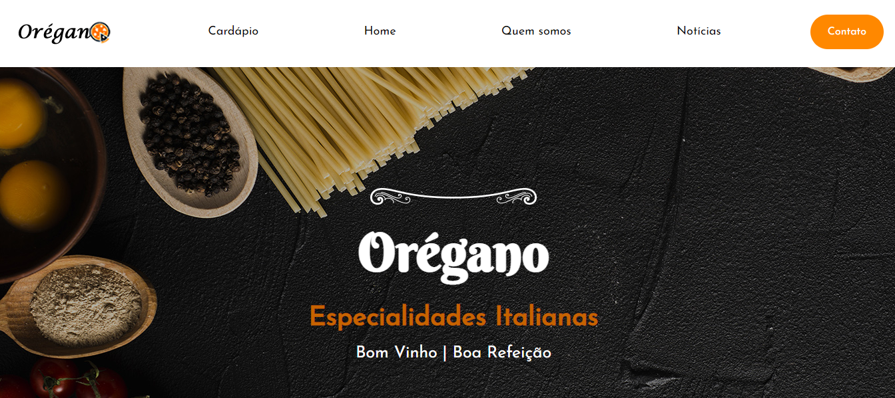
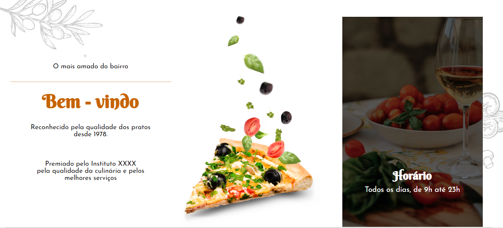
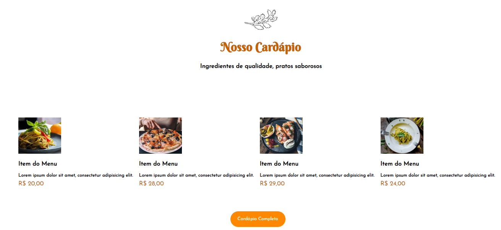
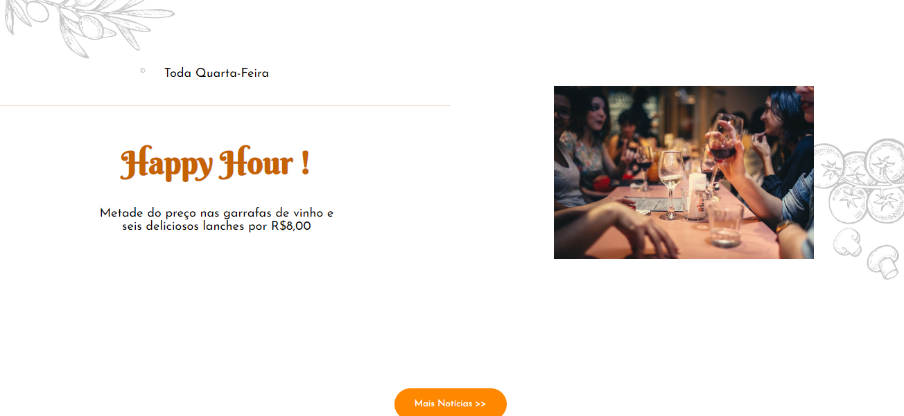
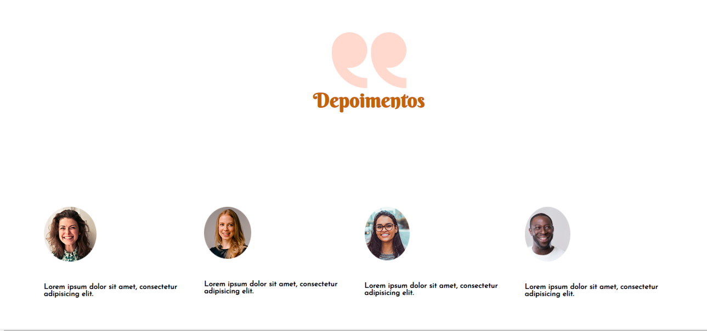
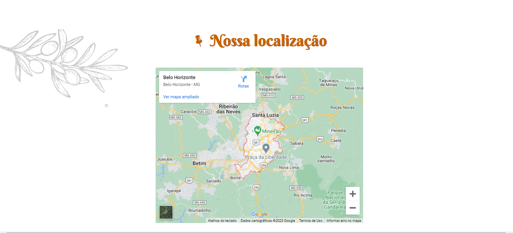
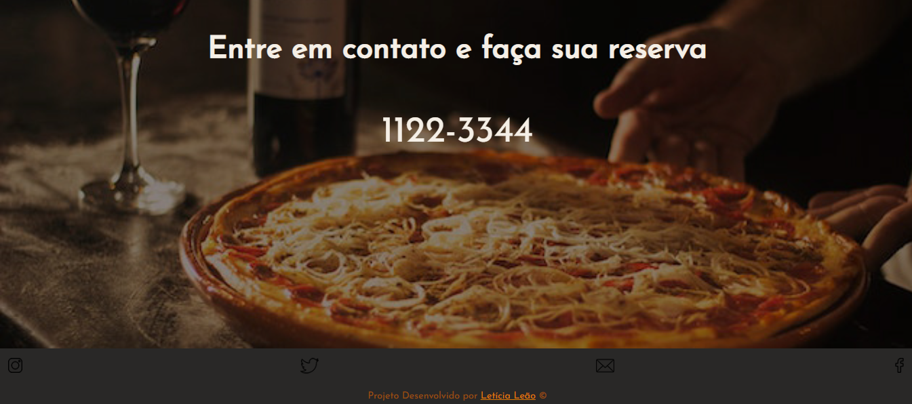
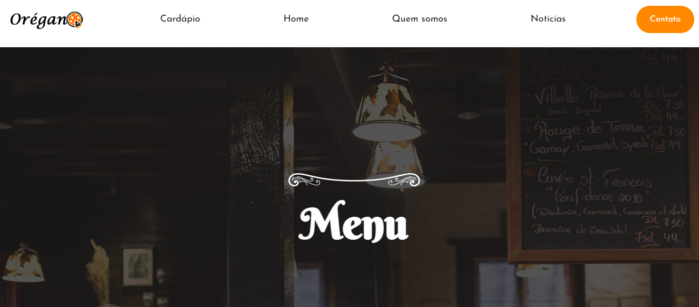
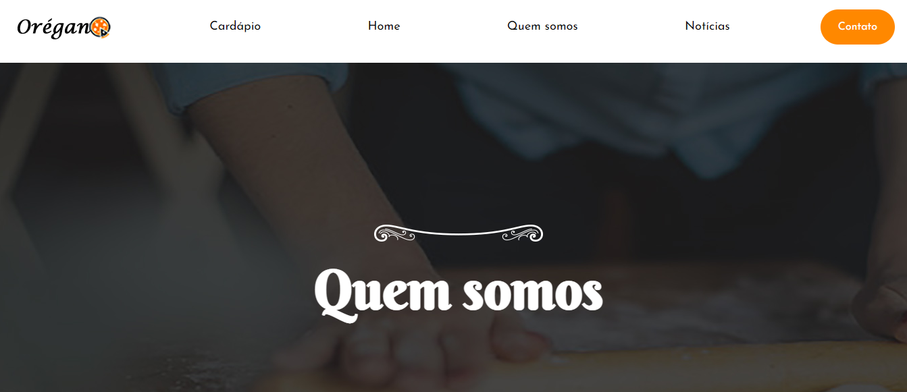

# Página de um restaurante Italiano

## Página desenvolvida com HTML e CSS (Design responsivo)   

## [👉🏽Clique aqui para acessar e navegar na página completa ](https://letsle.github.io/Oregano)

   
   
   
   
   
   
   
   
   

